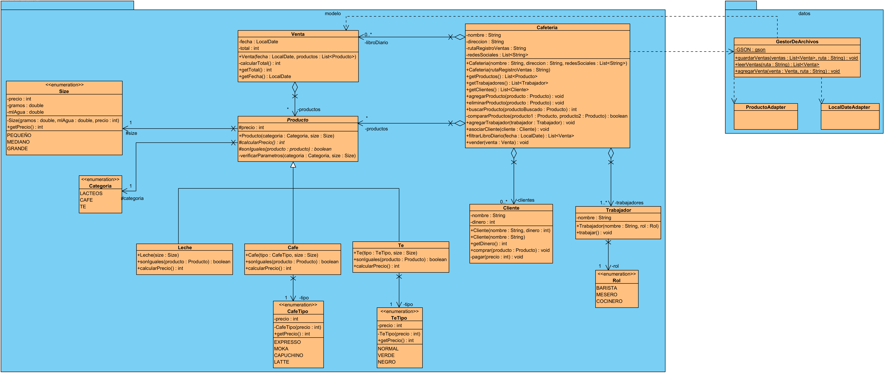
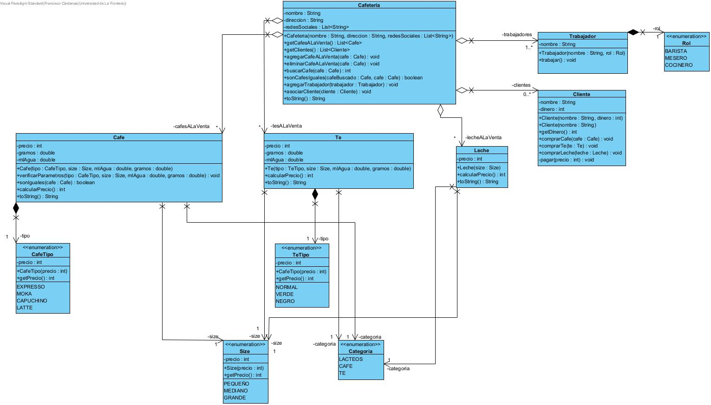

# Ayudantía 5
Se trabajó con la librería _**gson**_ para la gestión de datos del archivo **"Ventas.json"**. Se creó la clase abstracta **Producto** de la que heredan las clases _**Cafe**_, _**Te**_ y _**Leche**_

# Ayudantía 4

# Ayudantía 3

Se añade una relación de **Asociación** entre la _Cafeteria_ y el _Cafe_ y el _Te_, porque atributos de la clase _Cafeteria_ son instancias de las otras clases mencionadas.

## Diagrama de Clases

