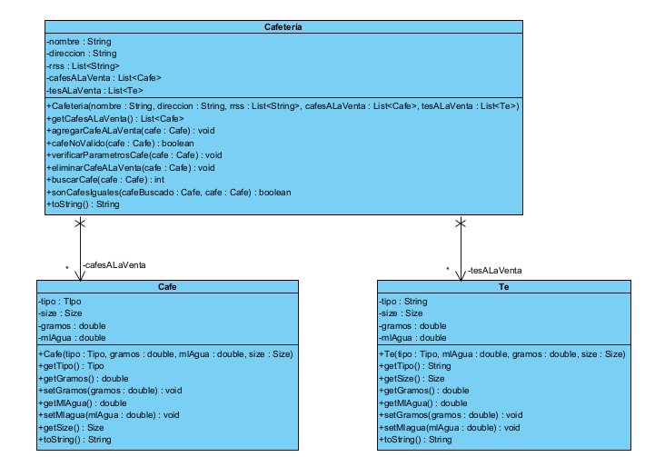

# Ayudantía 3

Se añade una relación de **Asociación** entre la _Cafeteria_ y el _Cafe_ y el _Te_, porque atributos de la clase _Cafeteria_ son instancias de las otras clases mencionadas.

## Diagrama de Clases

